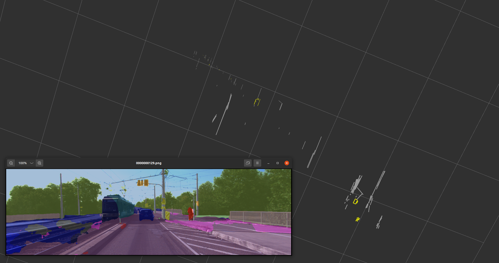

# SV-SLAM

<p align = "center">

</p>

# Requirements

## CMake

version: `3.12+`

Normally if your system is `Ubuntu 18.04`, you should upgrade your cmake.

**ref**： https://zhuanlan.zhihu.com/p/93480024

# Backward-cpp

```
sudo apt-get install libdw-dev
sudo wget -p /usr/include https://github.com/bombela/backward-cpp/blob/master/backward.hpp
```

**ref**: https://zhuanlan.zhihu.com/p/397148839

# CUDA &　CUDNN

**CUDNN**

Download: https://developer.nvidia.com/zh-cn/cudnn
`cuDNN Library for Linux`

unzip

```
sudo cp cuda/include/cudnn*.h /usr/local/cuda/include
sudo cp cuda/lib64/libcudnn* /usr/local/cuda/lib64
sudo chmod a+r /usr/local/cuda/include/cudnn*.h 
sudo chmod a+r /usr/local/cuda/lib64/libcudnn*
```

**check**
`cat /usr/local/cuda/include/cudnn_version.h | grep CUDNN_MAJOR -A 2`

## LibTorch

https://pytorch.org/get-started/locally/

unzip to lib

**Possible problem**

```
make[2]: *** No rule to make target '/home/chrisliu/Softwares/libtorch/lib/libc10.so', needed by '/home/chrisliu/ROSws/SV-SLAM_ws/devel/lib/libsegmentor_lib.so'. Stop.
```

`sudo ln -s /usr/local/cuda-11.5 /usr/local/cuda`
`rm -rf build devel`

## PCL

`sudo apt-get install libpcl-dev pcl-tools`

or

https://pcl.readthedocs.io/projects/tutorials/en/latest/compiling_pcl_posix.html

Download release version of PCL from https://github.com/PointCloudLibrary/pcl/releases

```
cd pcl && mkdir build && cd build
cmake -DCMAKE_BUILD_TYPE=Release ..
make -j2
sudo make -j2 install
```

## mmsegmentation

1. Clone packages

   ```bash
   cd lib
   git clone https://github.com/open-mmlab/mmsegmentation.git
   ```

2. `MMSegmentation` Requirements, please refer to <https://mmsegmentation.readthedocs.io/en/latest/get_started.html#installation>

   every time you change the path of `mmsegmentation` must not forget to run

   ```bash
   cd mmsegmentation
   pip install -e .
   ```

## pybind11

1. Clone packages

   ```bash
   cd lib
   git clone https://github.com/pybind/pybind11.git
   ```

## Colmap

https://colmap.github.io/install.html#library

## Lin3Dpp

```
sudo apt install libtclap-dev
sudo apt install rapidjson-dev
```
```
cd lib
git clone https://github.com/manhofer/Line3Dpp.git
cd Line3Dpp
mkdir build
cd build
cmake ..
make
```
**Problems:**
```
error: ‘struct ceres::Solver::Options’ has no member named ‘num_linear_solver_threads’; did you mean ‘linear_solver_type’?
options.num_linear_solver_threads = boost::thread::hardware_concurrency();
^~~~~~~~~~~~~~~~~~~~~~~~~
linear_solver_type
```
change `options.num_linear_solver_threads` to `options.num_threads`
## Potential problems

**undefined reference to `TIFFReadRGBAStrip@LIBTIFF_4.0'**

solution： https://blog.csdn.net/wphkadn/article/details/102504573

move/delete `libtiff.so``libtiff.so.5``libtiff.so.5.6.0` under your anaconda env


**python3-empy**

```
CMake Error at /opt/ros/noetic/share/catkin/cmake/empy.cmake:30 (message):
  Unable to find either excecutable 'empy' or Python module 'em'...  try
  installing the package 'python3-empy
```

`conda install -c conda-forge empy`
